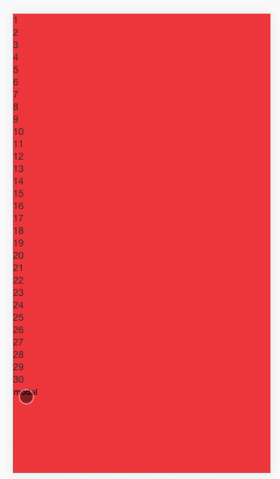
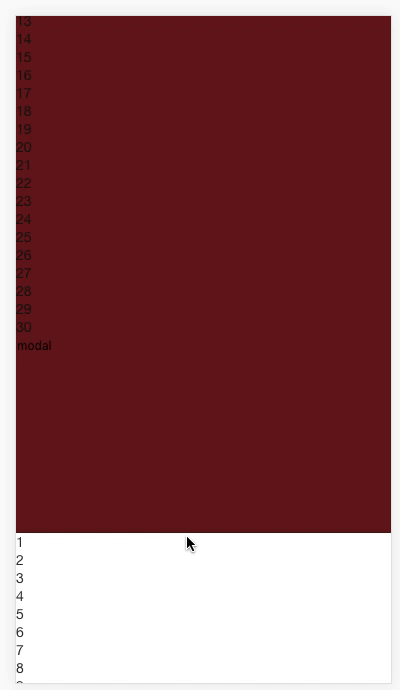

# vue-frozen
在移动端开发中，fixed布局的遮罩层滚动过程中滚动动作会干涉到下层元素滚动，vue-frozen可以很好的解决这个问题，只需在遮罩层或者你需要禁止击穿的外层元素上使用`v-frozen`指令即可。

**效果示例-使用前：**


**效果示例-使用后:**


## 使用
step-1. 使用npm:
```
npm install --save vue-frozen
```
step-2. `main.js`引入`vue-frozen`并注册:
```javascript
import vueFrozen from 'vue-frozen'
Vue.use(vueFrozen);
```
step-3. 在需要禁止滚动击穿的元素上使用`v-frozen`指令:
```javascript
<div class="mask" v-frozen></div>
```


